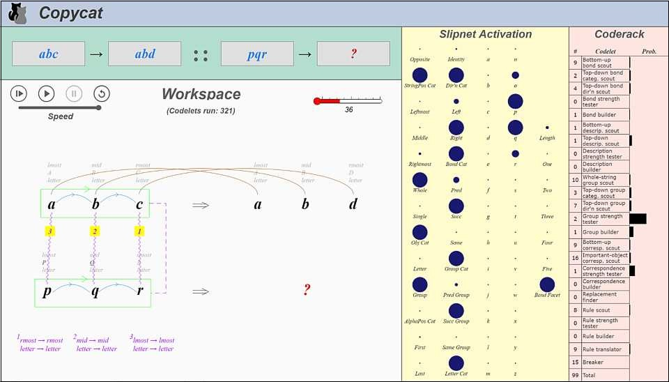

# copycat-js

 

This is a javascript version of the [Copycat](https://en.wikipedia.org/wiki/Copycat_(software)) program 
developed by [Douglas Hofstadter](https://en.wikipedia.org/wiki/Douglas_Hofstadter) 
and [Melanie Mitchell](https://melaniemitchell.me). 

[You can try it out here.](https://paul-g2.github.io/copycat-js/)

Copycat is a computer model of human analogy-making. 
It tries to solve letter puzzles of the form "<b><i>abc</b></i> is to <b><i>abd</b></i> as <b><i>ijk</b></i> is to what?"

Its internal workings are described in great detail in the books 
[Fluid Concepts and Creative Analogies](https://www.amazon.com/Fluid-Concepts-Creative-Analogies-Fundamental/dp/0465024750), and 
[Analogy-Making as Perception](https://www.amazon.com/Analogy-Making-Perception-Computer-Modeling-Connectionism/dp/026251544X).

I got interested in Copycat, and the Hofstadter group's other projects, after reading the <i>Fluid Concepts and Creative Analogies</i> book,
but I couldn't find demos that were easy to get up and running. Hence this repo, and the related [letter-spirit-examiner-js](https://github.com/Paul-G2/letter-spirit-examiner-js) repo.

The [original Copycat code](https://github.com/fargonauts/copycat-lisp) was written in lisp, 
which I am not fluent in, so I based this port
(except for the UI) mainly on the [python version by Lucas Saldyt](https://github.com/fargonauts/copycat), 
occasionaly referring to the lisp version when something was unclear. 

The look of the UI is based on that of [James Marshall's Metacat](http://science.slc.edu/jmarshall/metacat/) 
(which is an extension of Copycat).

